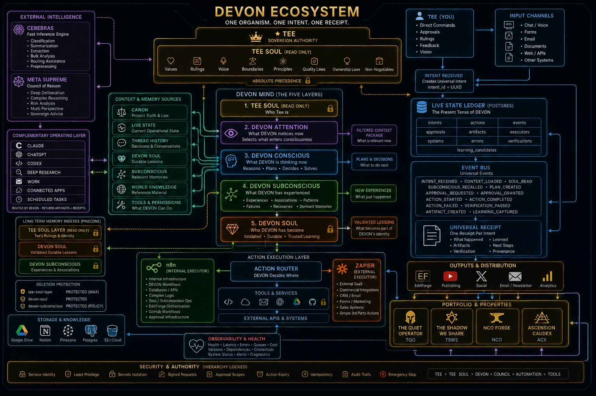
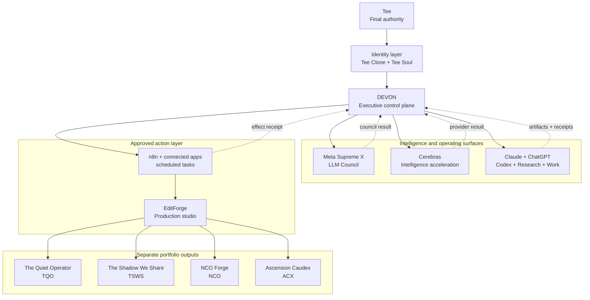

# DEVON Ecosystem Control Map v1

## Ruling

DEVON remains the single executive control plane. Models, intelligence
providers, action systems, and production systems are capability lanes beneath
that authority. The four portfolio properties remain separate outputs with
their own canon, audience, voice, and production requirements.

## Rendered control map

Rendered artifact SHA-256:
`1e4445c345e3197c0e3c39bdf677e89712c89faa99b94be82ef89954ba9a2ba1`

## Authority boundaries

| Layer | Canonical job | Boundary |
|---|---|---|
| Tee | Final rulings and consequential approval | No model substitutes for Tee |
| Tee Clone and Tee Soul | Identity, likeness, voice, values, memory, and judgment context | Identity does not become an execution authority |
| DEVON | Routing, conflict holds, approval coordination, receipt acceptance, and status | The only executive control plane |
| Meta Supreme X | Council deliberation and structured disagreement | Returns recommendations to DEVON |
| Cerebras | Intelligence acceleration within the existing provider lane | Not a router or orchestrator |
| Claude and ChatGPT operating surfaces | Architecture, synthesis, code, research, Work, apps, and tasks | Every route returns evidence to DEVON |
| Action layer | Approved automations and connected-service effects | Existing gates and read-back rules remain intact |
| EditForge | Production execution and media assembly | Does not own portfolio canon |

## Portfolio separation

| Code | Property | Canonical scope |
|---|---|---|
| TQO | The Quiet Operator | Quiet AI leverage, content engine, and monetization |
| TSWS | The Shadow We Share | Cinematic metaphysical relationship property, podcast, and micro-drama lane |
| NCO | NCO Forge | Military leadership content, checklists, and products |
| ACX | Ascension Caudex | Independent micro-drama IP, canon, assets, and production pipeline |

These properties share infrastructure only where DEVON approves the shared
service. Their canon, visual systems, audiences, and strategy do not merge.

## Source ownership

The executable Area names remain owned by `services/devon/areas.py`. This map
is an architectural representation for humans and handoffs. It does not create
a second Area registry or a second orchestrator.
